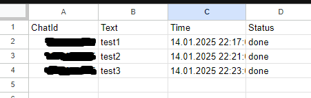

# Telegram Reminder Bot

This project is designed to automate reminder management using a Telegram bot. You can add, view, delete reminders, and clear all triggers with simple commands.

## Description

The bot integrates with Google Apps Script and uses the Telegram API to handle messages. Reminders are stored in Google Sheets, and time-based triggers are created to send reminders at the appropriate time.

## Bot Commands

- `/add text | YYYY-MM-DD HH:mm` – Adds a new reminder.
- `/list` – Displays all active reminders.
- `/delete number` – Deletes a reminder by its number.
- `/cleartriggers` – Clears all active triggers.
- `/startv` – Displays instructions for using the bot.

## Usage Examples

1. Add a reminder: /add Meeting | 2025-01-15 14:00
2. List reminders: /list
Result:
Your reminders:
Meeting - 2025-01-15 14:00
3. Delete a reminder: /delete 1
4. Clear all triggers: /cleartriggers

## Google Sheets Structure

- **Column A**: User's chat ID.
- **Column B**: Reminder text.
- **Column C**: Reminder date and time.
- **Column D**: Status (e.g., "done").

### Google Sheets Example:

#### 1. Reminder Data:

#### 2. Add Title Manually:
**Note**: Ensure you add the column title manually in Google Sheets to avoid issues with the bot's functionality.

## How to Set Up

1. Create a project in Google Apps Script.
2. Paste the code into the `Code.gs` file.
3. Update the following variables:
- `apiToken` – Your Telegram bot token.
- `appUrl` – Your webhook URL (from Google Apps Script).
4. Set up the webhook by running the `setWebhook` function.
5. Create a Google Sheet to store reminders.

## How It Works

1. The user sends commands via Telegram.
2. The bot processes the messages using the `doPost` function.
3. Data is stored in Google Sheets.
4. Reminder triggers are created using `ScriptApp.newTrigger`.
5. When a trigger fires, the bot sends a reminder message in Telegram.

## Authors

- Your Name
- [Telegram API Documentation](https://core.telegram.org/bots/api)
- [Google Apps Script Documentation](https://developers.google.com/apps-script)

## License

This project is licensed under the MIT License. You are free to use the code for any purpose.

---
